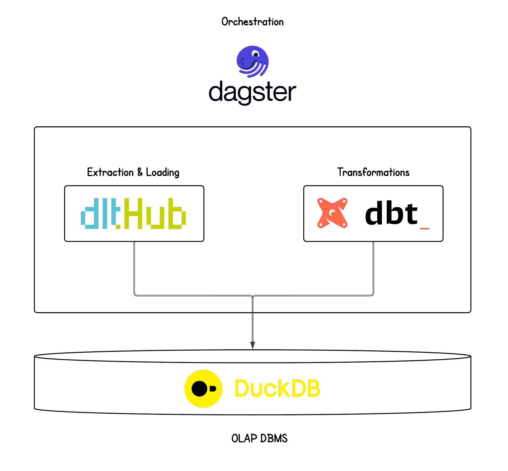

# Modern Data Stack: dlt + dbt + DuckDB + Dagster

 

A modern, lightweight data pipeline using:
- **[dlt](https://dlthub.com/)** (data load tool) for extraction and loading
- **[dbt](https://www.getdbt.com/)** for transformation
- **[DuckDB](https://duckdb.org/)** as the analytical database
- **[Dagster](https://dagster.io/)** for orchestration

## 🚀 Project Structure
...
├── dagster/ # Dagster pipelines and assets
├── data-warehouse/ # Raw data and processed outputs
├── dlt/ # Data extraction and loading scripts
├── models/ # dbt models
├── Data-Stack.jpeg # Architecture diagram
└── pyproject.toml # Python dependencies
...
